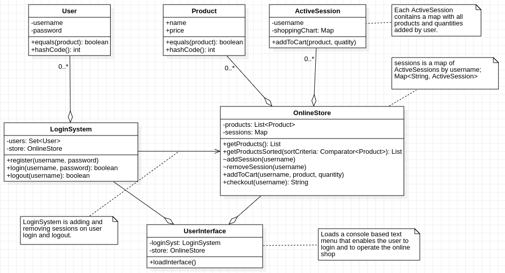

# Online Store

Given the UML class diagram above, implement the corresponding Java program.
The application's interface should be implemented as a console based menu.
Read the notes from the diagram to understand the requirements.

**Note 1: Constructors and setter\getter methods are not represented in the diagram but can\should be implemented."**

**Note 2: You can add any extra methods if required.**

**Note 3: Implement unit tests for the main operations.**
